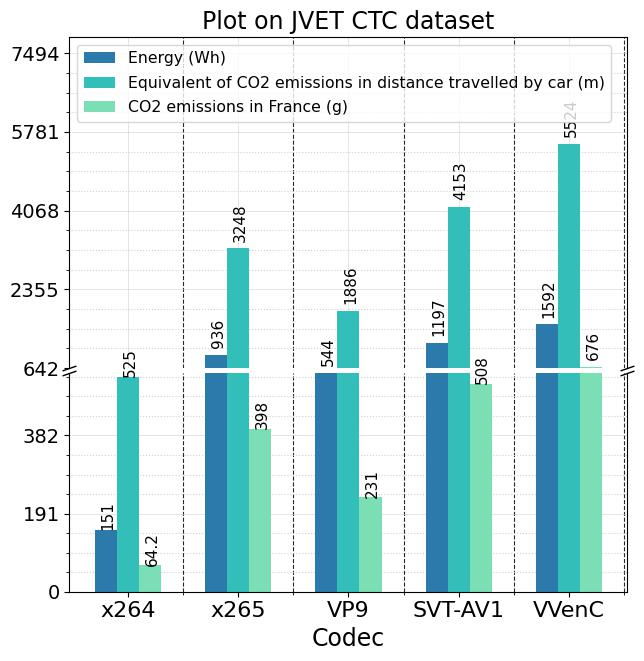
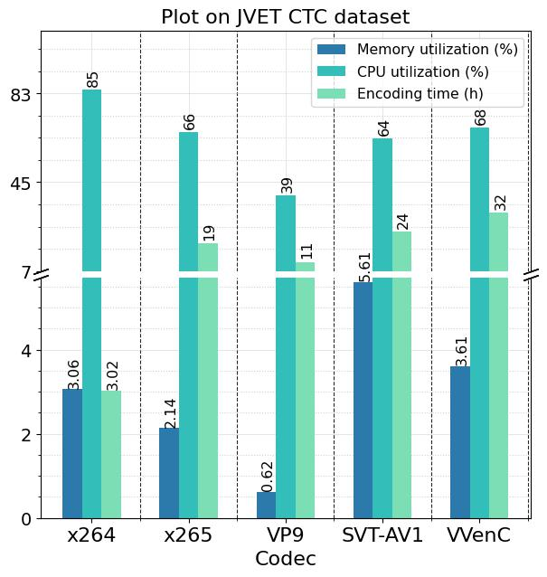
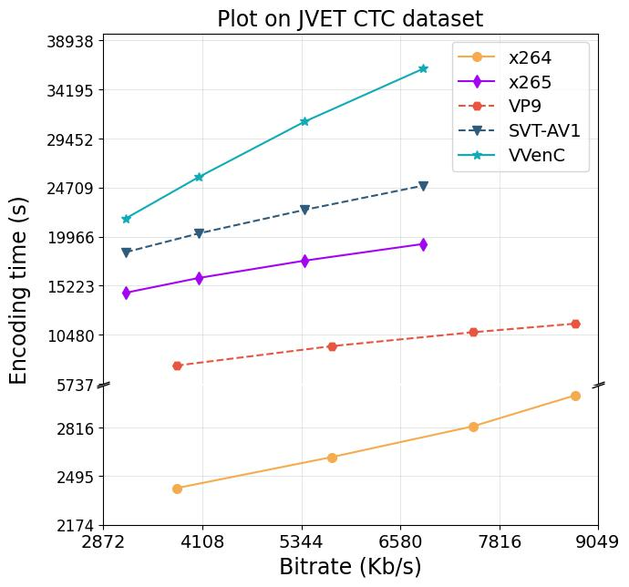
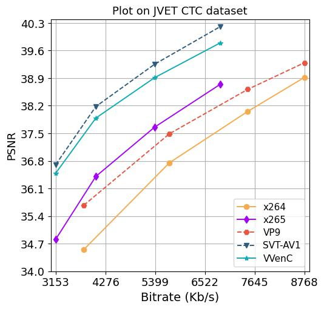
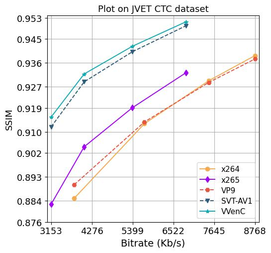
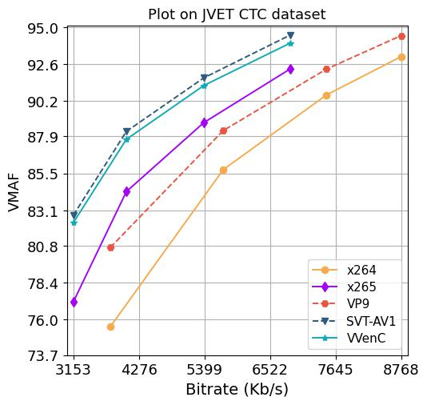

# Energy and Carbon Emissions of Modern Video Encoders
In this project, we provide a comparative study between five leading video coding standards, namely H.264/AVC, H.265/HEVC, H.266/VVC, VP9, and AV1 through their open-source and fast software encoders x264, x265, VVenC, libvpx-vp9, and SVT-AV1, respectively, in terms of quality, energy consumption and CO2 emissions. This study provides a better understanding of the trade-off between energy consumption, bitrate, and quality of different encoders and determines which is the most suitable for developing a green and sustainable video streaming solution.

## Install 


```bash
git clone https://github.com/chachoutaieb/encoding_energy_co2.git
pip3 install -r requirements.txt

```
- [Install VVenC](https://github.com/fraunhoferhhi/vvenc/)
- [Install VVdeC](https://github.com/fraunhoferhhi/vvdec)
- Install ffmpeg 5


## Download Dataset

- [x] [Original dataset](https://jvet.hhi.fraunhofer.de/)
- [x] The whole encoded dataset can be shared upon request. Please, send an email to taieb.chachou[at]gmail.com with Cc sfezza[at]ensttic.dz.
Note : make all the downloaded dataset in the dataset directory

## Usage

```bash

python3 /your-path-to-the-project/encoding_video.py
-s /your-path-to-the-project/original_dataset \
-t '/your-path-to-the-project/encoding_results.xlsx' \
-m psnr ssim vmaf

# you will see
```
```diff
green : Encoded video is ready
```
+--------------------------------------------------+----------+-------------+--------------+-------------+--------+--------+--------+
|                      Video                       | Time (s) |Bitrate(kb/s)| Energy (Wh)  |  CO2eq (g)  |  PSNR  |  SSIM  |  VMAF  |
+--------------------------------------------------+----------+-------------+--------------+-------------+--------+--------+--------+
|      BasketballPass_450k_50fps_libx264.mp4       |  11.09   |     494     | 0.0004136871 | 0.004615921 | 33.69  |  0.92  | 81.68  |
+--------------------------------------------------+----------+-------------+--------------+-------------+--------+--------+--------+
|      BasketballPass_300k_50fps_libx264.mp4       |  10.04   |     334     | 0.0004155239 | 0.004201178 | 31.87  |  0.89  | 70.67  |
+--------------------------------------------------+----------+-------------+--------------+-------------+--------+--------+--------+
|      BasketballPass_200k_50fps_libx264.mp4       |  9.424   |     227     | 0.0004102921 | 0.003958067 | 30.10  |  0.85  | 56.84  |
+--------------------------------------------------+----------+-------------+--------------+-------------+--------+--------+--------+
|      BasketballPass_120k_50fps_libx264.mp4       |  8.045   |     140     | 0.0004035947 | 0.003277615 | 28.03  |  0.79  | 37.30  |
+--------------------------------------------------+----------+-------------+--------------+-------------+--------+--------+--------+
|      BasketballPass_384k_50fps_libx265.mp4       |  130.3   |     428     | 0.0003023713 | 0.039415766 | 34.22  |  0.92  | 82.99  |
+--------------------------------------------------+----------+-------------+--------------+-------------+--------+--------+--------+


## Results

### Encoding performance (Energy, CO2 emissions, Encoding time, CPU and memory usage)


  Energy and CO2 emissions     |  CPU and memory usage         |  Encoding time                | 
:-----------------------------:|:-----------------------------:|:-----------------------------:
   |   |     


 
 ### Quality
 
 
 
   PSNR     |  SSIM         |  VMAF                | 
:-----------------------------:|:-----------------------------:|:-----------------------------:
   |   |    
 _relative_Energy.jpg)  | _relative_Energy.jpg)  |  _relative_Energy.jpg)    
     
  


